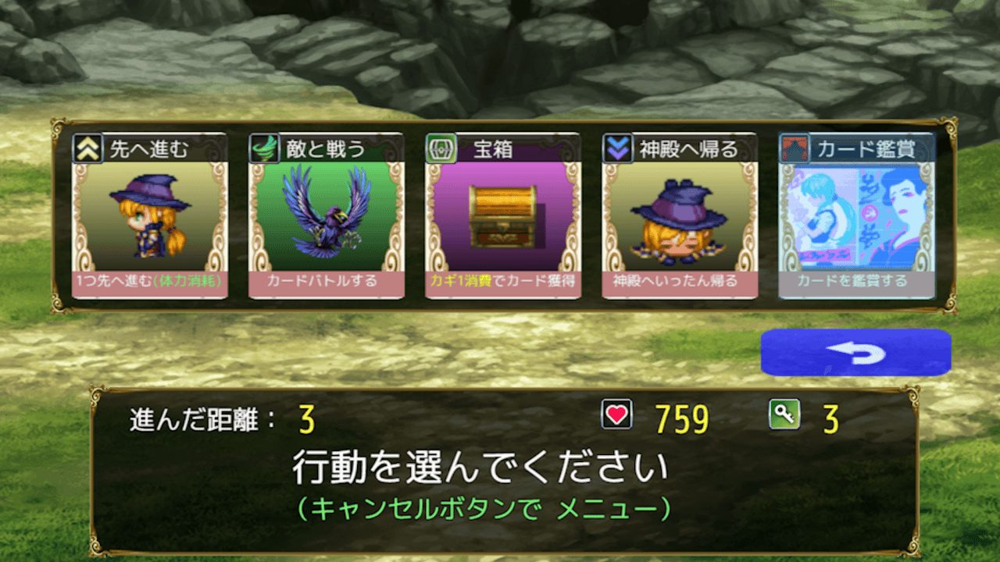
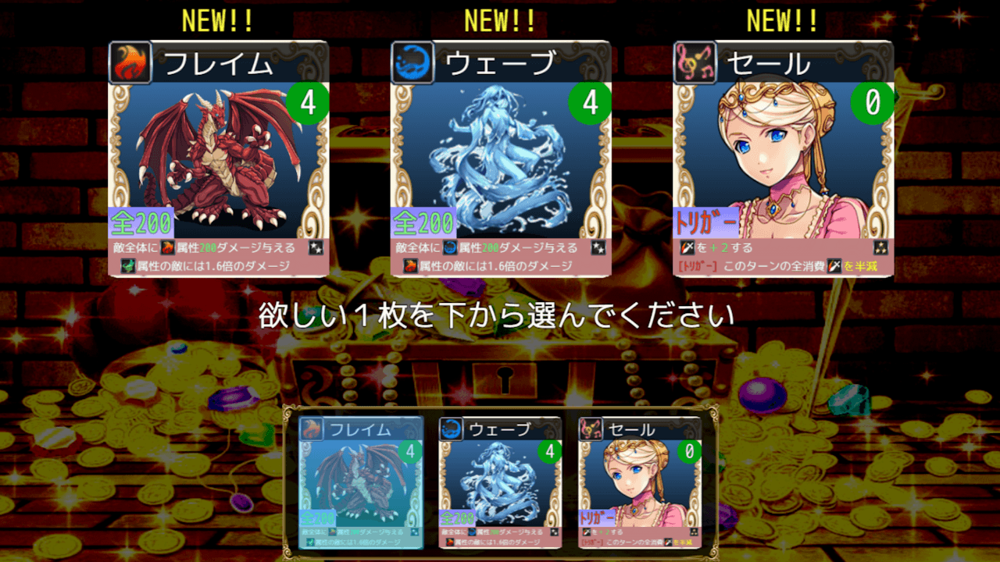

# プラグイン置き場の [リポジトリ 一覧へ](https://github.com/nolimits-tukool?tab=repositories)  
RPGツクール用プラグイン、サンプルプロジェクトを置いています  
- [キャラクターサイズ 一括拡大プラグイン](https://github.com/nolimits-tukool/NLM_CharacterSizeMZ) (2026/5/14)
- [シンプルなHDレイアウト・プラグイン](https://github.com/nolimits-tukool/NLM_SimpleHDLayoutMZ) (2026/5/8)
- [MZ用ボタン幅拡大プラグイン](https://github.com/nolimits-tukool/NLM_ButtonWidthMZ) (2026/5/3)
- [MZ用コマンド行間設定プラグイン](https://github.com/nolimits-tukool/NLM_CommandHeightMZ) (2026/5/2)
---

# [カードゲームMZサンプル3R](https://github.com/nolimits-tukool/CardGameMZSample3R)
### RPGツクールMZ専用のサンプル・プロジェクト(2026/5/15)

カードゲームを作りたいけど、どうやって作っていいか分からない方、  
自分の描いたイラストをゲームにしてみたい方などへ 
  
今作は [無印３](https://github.com/nolimits-tukool/CardGameMZSample3) を **「HD画面ノンフィールド型カードゲーム」** に改造したものです  
プラグイン・コモンイベント数が増えているため **「やや上級者向け」** のサンプルプロジェクトになります  
（内容が難しいと感じる方は、先に [無印３](https://github.com/nolimits-tukool/CardGameMZSample3) から始めて下さい）

PLiCy「カード使いのケイシー3R」にて、ブラウザ版の [テストプレイができます](https://plicy.net/GamePlay/228669)

## 「カードゲームMZサンプル3R」(プラグイン計11個入り) を [download](https://github.com/nolimits-tukool/CardGameMZSample3R/raw/refs/heads/main/CardMZSample3R.zip)  
　　RPGツクールMZ専用プロジェクトです  
　　download解凍後は「readme.txt」に利用方法が書いてあります  
　　本プロジェクトのデータを土台として改変し、自作ゲーム作品を完成させるのも問題ありません

---

### 現在のバージョン： v3R.0.0 (2026/05/15)
